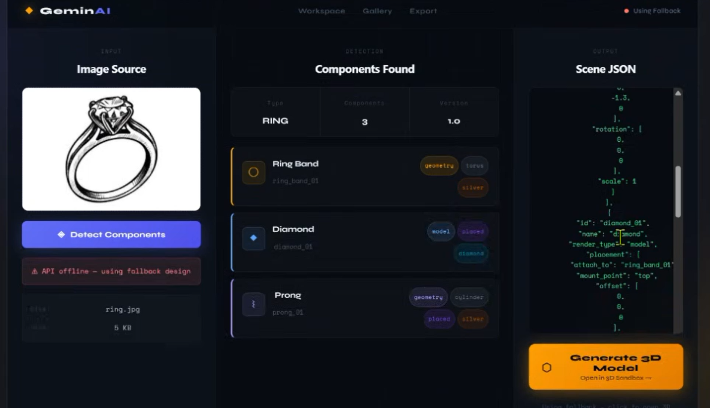
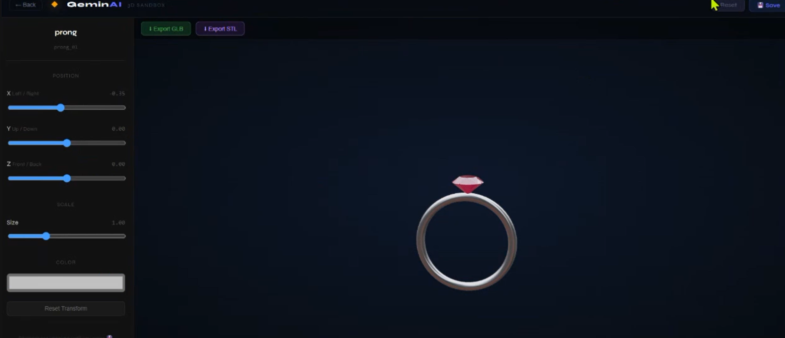
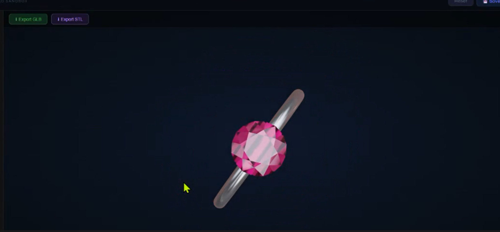
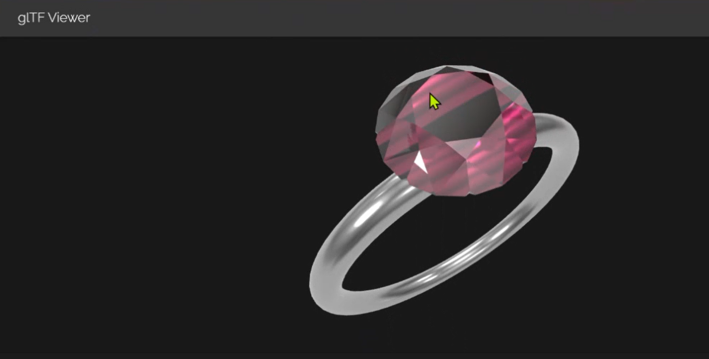

**SYRUS Hackathon 2026 – CodeCell VESIT** 

**Track:** Agentic AI (Rezinix AI) | **Team:** Team INSPIRE

---
# GeminAI – Dil se Design Tak

  

## Overview

GeminAI is an AI-powered system that converts 2D jewelry images into production-ready 3D models while enabling real-time customization of gemstones, materials, and colors using a component-based reconstruction pipeline.

Unlike traditional systems that regenerate an entire model for small edits, GeminAI builds jewelry using modular reusable components, enabling low-latency edits and interactive design workflows.

---

## Problem Overview

Generative AI tools can easily create 2D jewelry designs, but converting them into accurate, manufacturable 3D models remains difficult.

Current workflows suffer from several limitations:

- Converting flat jewelry images into structurally valid 3D geometry is complex.
- Small design changes (metal type, gemstone replacement) often require manual CAD editing.
- Many systems treat jewelry as a single mesh, making component-level editing impossible.
- Re-running generative models for every modification results in high latency and computational cost.

---

## Our Solution

GeminAI solves this by introducing a **component-based AI pipeline**.

Instead of generating a single mesh, the system:

1. Detects jewelry components (gemstones, bands, prongs, settings).
2. Converts them into a parametric JSON scene representation.
3. Reconstructs the jewelry using prebuilt 3D component assets.
4. Allows real-time modifications without regenerating the entire design.

This enables fast rendering, modular editing, and realistic previews suitable for both designers and retail environments.

---

## Core Features

### 1. Fast 2D → 3D Conversion
Automatically convert jewelry images into 3D models while preserving proportions and structural integrity.

### 2. Component Recognition
AI detects components such as:
- Gemstones
- Bands
- Prongs
- Settings
- Decorative elements

This enables structured reconstruction and precise editing.

### 3. Real-Time Customization
Users can modify:
- Gemstone type
- Metal material
- Surface finish
- Colors
- Component placement

Changes update instantly without rebuilding the entire model.

### 4. Prebuilt Component Library
A reusable asset library containing:
- Diamonds
- Pearls
- Prongs
- Settings
- Metal bands

Using reusable components significantly reduces rendering time and latency.

### 5. Realistic Initial Rendering
The system generates jewelry models with gemstones and materials already applied, avoiding empty placeholder models.

### 6. Exportable 3D Models
Generated models can be exported in:
- **GLB** – for real-time rendering
- **STL** – for manufacturing and CAD workflows

---

## System Architecture

| Step | Description |
|------|-------------|
| **Step 1 – Image Input** | User uploads a 2D jewelry image. |
| **Step 2 – Component Detection** | AI vision model detects structural components such as gemstones and metal parts. |
| **Step 3 – JSON Scene Generation** | Detected components are converted into a parametric JSON structure describing component type, geometry, size, position, and materials. |
| **Step 4 – 3D Reconstruction** | A Three.js rendering engine assembles the final jewelry model using prebuilt OBJ assets. |
| **Step 5 – Interactive Customization** | Users can modify materials and gemstones in real time. |
| **Step 6 – Export** | Final design can be exported as GLB or STL for visualization or manufacturing. |

---

## Tech Stack

| Layer | Technologies |
|-------|-------------|
| **Frontend** | React.js, Three.js / React Three Fiber, Drei |
| **Backend** | Python, Flask API |
| **AI & Image Processing** | Gemini Vision API, Hunyuan 2.0, PIL |
| **3D Assets & Rendering** | OBJ model library, Parametric JSON scene format |
| **Output** | GLB, STL |

---

## Key Innovations / USP

- **Intelligent Component Detection** – AI identifies structural jewelry elements directly from images.
- **Smart Geometry Inference** – The system estimates depth and structure required for realistic 3D reconstruction.
- **Parametric Component Modeling** – Jewelry parts are generated with adjustable parameters: size, shape, and placement.
- **Component-Based Reconstruction** – Models are assembled using reusable components instead of regenerating meshes.
- **Low Latency Editing** – Real-time updates allow instant design iteration.
- **Budget-Aware Customization** – The system can recommend alternative materials or gemstones that match a specified budget.
- **Real-Time Cost Estimation** – Dynamic pricing based on gemstone type, metal type, and component sizes.

---

## Implementation Status

<table>
  <tr>
    <td></td>
    <td></td>
  </tr>
  <tr>
    <td></td>
    <td></td>
  </tr>
</table>

### ✅ Completed
- 2D image input and AI component detection
- Prebuilt 3D component library (OBJ models)
- Component-based 3D reconstruction
- Interactive customization (position, size, materials)
- Model export (GLB / STL)

### 🔮 Future Work
- **Complex Geometry Generation** – Integrate Hunyuan 2.0 for intricate jewelry meshes.
- **Budget Estimation System** – Add cost estimation based on material and gemstone choices.
- **Smart Recommendations** – Suggest alternative gemstones or metals based on user budget.
- **Expand Component Library** – Add more assets: gemstone cuts, prongs, chains, pendants, earrings.
- **Enhanced JSON Scene Representation** – Improve scene structure for higher reconstruction accuracy.

---

## Potential Applications

- Jewelry design studios
- Custom jewelry retailers
- Online jewelry visualization
- Manufacturing and prototyping pipelines
- AR/VR jewelry preview systems
